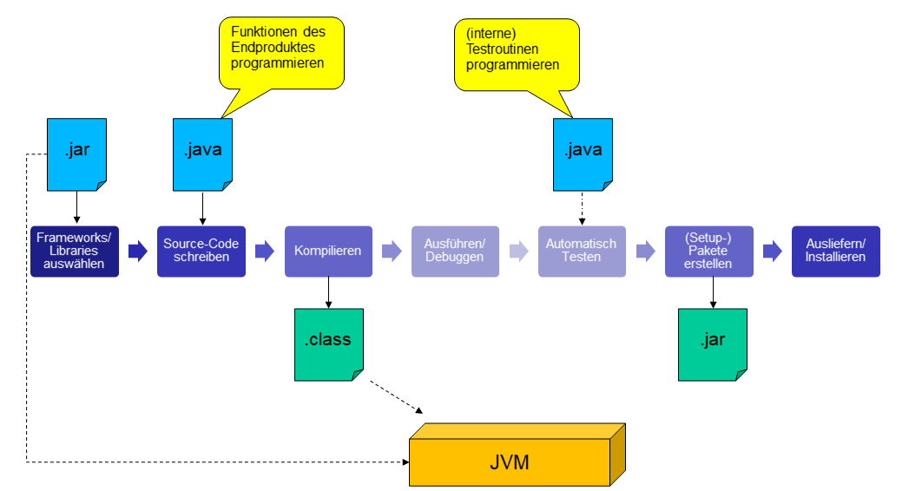

# Maven Buildsystem
Automatischer Build mit Maven.

## Der Software-Entwicklungsablauf
Wie arbeitet man als Programmierer, wenn man eine Software erstellt von Beginn an bis zur Installation des fertigen Produkts:



Prinzipiell geht man folgende Schritte durch (vereinfachte Darstellung):
 1. __Frameworks/Libraries auswählen__: mit der Entwicklungsumgebung der Wahl legt man ein neues Java-Projekt an. 
	Viele Funktionalitäten können auch aus bestehenden Libraries genommen werden, z.B. GUIs kann man mit JavaFX erstellen.
	Diese Libraries müssen im Projekt inkludiert werden, d.h. man läd die entsprechenden JAR-Dateien herunter und bindet sie im Projekt ein.
 2. __Source-Code schreiben__: jetzt kann man die Sourcen schreiben und programmieren. In dieser Phase erstellt man nicht nur Java-Dateien, 
	sondern fügt dem Projekt auch weitere verwendete Ressourcen, z.B. Bilder hinzu.
 3. __Kompilieren__: ist man mit dem Programmieren - zumeist bereits bei einem Teilschritt - fertig, so kann man die Sourcen kompilieren. 
	Der Kompiler ```javac``` erstellt im`Erfolgsfall, d.h. wenn es zu keinen Kompilierfehlern kommt, Class-Dateien. 
	Das sind plattformunabhängige Binärdateien, die auf der Java-Virtual-Machine (JVM) ausgeführt werden können.
 4. __Ausführen/Debuggen__: Das Programm wird zunächst beim Entwickler ausgeführt, damit dieser seinen geschriebenen Sourcecode
    testen kann.
 5. __Automatische Tests__: Da das manuelle Testen von Programmen sehr mühsam und zeitaufwendig ist, schreiben professionelle 
    Entwickler sogenannte Test-Routinen, das sind ebenfalls Java-Dateien, die allerdings programmierte Funktionen des Endprodukts 
	überprüfen und bei Fehlern Alarm schlagen können. Diese können dann einfach automatisch ausgeführt werden und der Entwickler
	bekommt so viel schneller Rückmeldung ob das Programm richtig funktioniert.
	Hinweis: diese Java-Dateien müssen natürlich auch zuvor kompiliert werden, das geschieht auch im Schritt 3.
 6. __(Setup-)Packete erstellen__: Der Endkunde wird nicht mit den Sourcen arbeiten sondern soll stattdessen ein "ausführbares Programm" erhalten. 
    Hier werden alle benötigten Class-Dateien und Ressourcen zu einer JAR-Datei zusammengefasst.  
	JAR bedeutet Java-Archive und ist in Wirklichkeit eine ZIP-Datei, mit einer vorgegebenen internen Struktur.
 7. __Ausliefern/Installieren__: Um das fertige Produkt beim Endkunden zum Laufen zu bringen wird am Zielsystem die benötigte
    Java Runtime installiert (JRE) und die JAR-Datei auf die Festplatte installiert. Von dort kann der User das Programm mit dem Java-Interpreter ```java``` ausführen.

Bis jetzt haben wir die Aufgaben eines Entwicklers in den verschiedenen Phasen als manuelle Tätigkeiten kennengelernt,
die fehleranfällig, mühsam (finden und herunterladen von Libraries) und zeitraubend sind.  
Das automatische Build-System Maven kann dem Entwickler viele Aufgaben abnehmen und die Arbeit dadurch vereinfachen.

## Grundlagen
### Maven ist ein:
* ... Software-Project __Management Tool__, es  
	verwaltet das Erstellen von Software von ihrem Beginn an, dem Auswählen der Plattform, der Frameworks 
	über das Programmieren bis hin zum Erzeugen und installieren der fertigen SW-Lösung
* ... deklaratives __Build-System__
	* __Convention over Configuration__, d.h. es gibt viele Standardeinstellungen die das Verhalten des Build-Systems definieren, 
      die nicht konfiguriert werden müssen. In der Konfigurationsdatei (pom.xml) werden nur die Änderungen und Erweiterungen festgelegt.
	* Wiederverwendung von oft genutzter Funktionalität durch __Plugins__, die bereitgestellt werden 
	* __Dependency Management__: die im Projekt verwendeten Frameworks und deren Abhängigkeiten werden von Maven automatisch aus dem __Repository__ nachgeladen.
* Tool für technisches Projekt-Reporting

### Maven ist Open-Source
von der Apache-Foundation gehostet: (http://maven.apache.org/what-is-maven.html)


### Ziel: 
Vereinheitlichen und Automatisieren von
* __Build__: Viele in der obigen Abbildung dargestellten Schritte werden nach einem "anstoß" von Maven automatisch erledigt.
* __Verteilung__: fertige Pakete werden erstellt und diese können bei Bedarf automatisch auf Server installiert werden, z.B. bei Web-Applikationen.
* __Reporting__: die Ergebnisse der Build-Phasen und der automatisierten Tests werden in lesbare Reports abgespeichert 
  und können z.B. auch an die Entwicklungsleiter versendet werden.

## Konfiguration mittels POM
Das "Project Object Model" (POM) beschreibt ein Projekt für Maven:
* Identifikation mittels "__Artefakt-Koordinaten__" (das ist ein beliebiger Projekt-Name)
* Was das Projekt enthält. (Sourcedateien, Ressourcedateien, Testdateien,...)
* Welche __Abhängigkeiten__ das Projekt hat. (JARs, minimale Java-Version..)
* Welche __Aufgaben (Ziele)__ ausgeführt werden können? (compile, test, package,..)
als XSD-basierte XML-Datei.

### Beispiel eines (nahezu) minimalem POM:
```xml
<?xml version="1.0" encoding="UTF-8"?>
<project xmlns="http://maven.apache.org/POM/4.0.0"
         xmlns:xsi="http://www.w3.org/2001/XMLSchema-instance"
         xsi:schemaLocation="http://maven.apache.org/POM/4.0.0 http://maven.apache.org/xsd/maven-4.0.0.xsd">
    <modelVersion>4.0.0</modelVersion>

    <groupId>at.htl-donaustadt.hit</groupId>
    <artifactId>htl-sew-java</artifactId>
    <version>1.0-SNAPSHOT</version>
	
    <properties>
        <java.version>15</java.version>
        <javafx.version>13</javafx.version>
        <project.build.sourceEncoding>UTF-8</project.build.sourceEncoding>
        <maven.compiler.source>${java.version}</maven.compiler.source>
        <maven.compiler.target>${java.version}</maven.compiler.target>
    </properties>

    <build>
        <plugins>
            <plugin>
                <groupId>org.apache.maven.plugins</groupId>
                <artifactId>maven-compiler-plugin</artifactId>
                <version>3.8.1</version>
                <configuration>
                    <source>${java.version}</source>
                    <target>${java.version}</target>
                    <release>${java.version}</release>
                </configuration>
            </plugin>
        </plugins>
    </build>
</project>	
```

Hauptelement:
* Das Hauptelement ```project``` ist vorgegeben und wird benötigt, damit Maven die Datei als POM erkennt.
* ```groupId``` gibt die Ersteller-Organisation des Projektes in verkehrter-Domainschreibweise an
* ```artifactId``` ist der Projektname
* ```version``` kann verwendet werden um Versionsnummer des Projektes anzugeben

Properties:
* In der ```Properties```-Elementgruppe werden Grundeinstellungen getätigt, die auch im weiteren POM wiederverwendet werden können,
  hier ist es
* die Java-Version 15 (```java-version```), 
* die JavaFX-Version 13 (```javafx.version```),
* und die Angabe, dass die Source-Dateien UTF-8 kodiert sind (```project.build.sourceEncoding```)

Build-Plugins:  
zur Durchführung der unterschiedlichen Phasen im Entwicklungsprozess (compile, test, package,..)
können bereits verfügbare Plugins-Verwendet werden, die hier registriert sind.
Im obigen Bespiel gibt es nur das "__maven-compiler-plugin__", welches das Tool ```javac``` zum Kompilieren des Source-Codes verwendet.  
Im ```configuration```-Bereich kann man erkennen das eingestellt wird für welche Java-Version der Kompiler arbeiten soll.

* Im Kern ist Maven eine Laufzeitumgebung für Plugins
* Diese stellen die eigentlichen Build-Funktionen als "Goals" zur Verfügung
* Das "Super POM" macht die gebräuchlichsten Plugins verfügbar (compile, test, jar, ..)
* Weitere können in Projekt-POM registiert werden

### Beispiel mit Erweiterungen für JavaFX:
Um JavaFX zum Laufen zu bringen muss man folgende Erweiterungen im POM vornehmen:

```xml
<?xml version="1.0" encoding="UTF-8"?>
<project xmlns="http://maven.apache.org/POM/4.0.0"
         xmlns:xsi="http://www.w3.org/2001/XMLSchema-instance"
         xsi:schemaLocation="http://maven.apache.org/POM/4.0.0 http://maven.apache.org/xsd/maven-4.0.0.xsd">
    <modelVersion>4.0.0</modelVersion>

	...

    <dependencies>
        <dependency>
            <groupId>org.openjfx</groupId>
            <artifactId>javafx-graphics</artifactId>
            <version>${javafx.version}</version>
        </dependency>
        <dependency>
            <groupId>org.openjfx</groupId>
            <artifactId>javafx-controls</artifactId>
            <version>${javafx.version}</version>
        </dependency>
        <dependency>
            <groupId>org.openjfx</groupId>
            <artifactId>javafx-fxml</artifactId>
            <version>${javafx.version}</version>
        </dependency>	
    </dependencies>
	
    <build>
        <plugins>
			...
            <plugin>
                <groupId>org.openjfx</groupId>
                <artifactId>javafx-maven-plugin</artifactId>
                <version>0.0.4</version>
                <configuration>
                    <mainClass>ui.fx.samples.AllDemos</mainClass>
                </configuration>
            </plugin>
        </plugins>
    </build>

</project>	
```

Dependencies:
 * Der ```Dependencies```-Block legt die Abhängigkeiten zu den verwendeten Libraries/Frameworks fest.  
   Hier kann man erkennen, das folgende Libraries zum Einsatz kommen sollen:
 * __javafx-graphics__ (2D Zeichenroutinen in GUI-Fenstern)
 * __javafx-controls__ (Unterstützung von Standardcontrols, z.B. Button, TextField, Label,...)
 * __javafx_fxml__ (Unterstützung von FXML-Dateien um GUIs festzulegen)  

Die benötigten JAR-Dateien werden von Maven automatisch aus riesigen Bibliotheks-Katalogen (sogenannten Remote-Repositories)
geladen und der Entwickler muss sich nicht mehr weiter darum kümmern.

Die meisten Entwicklungsumgebungen haben Tools eingebaut, mit denen man in diesen Katalogen suchen und 
die benötigten ```dependency```-Einstellungen übernehmen kann.  
__Bei IntelliJ setzt man dazu den Cursor innerhalb des ```dependencies``` Blocks und drückt [Alt]-[Einfügen].__

JavaFX-Plugin:
 * Des weiteren wird das __javafx-maven-plugin__ hinzugefügt, mit dem man kompilierte JavaFX-Programme direkt
über Maven (inkl. der für JavaFX notwendigen Module in der Laufzeitumgebung) ausführen kann.
 * Dazu startet man das Maven-Ziel __javafx:run__, z.B. ```mvn javafx:run```
 * Das Element ```mainClass``` legt fest, welches der Klassen als Hauptprogramm gestartet wird.  

Tipp: In IntelliJ kann man sich auch automatisch eine __Configuration__ zum Ausführen direkt in IntelliJ (d.h. ohne Maven) anlegen lassen
indem man im Maven-Fenster mit der rechten Maustaste auf Plugins/javafx/javafx:run klickt und von dort "__Debug__" auswählt.

### Convention over Configuration
Es gibt eine allgemeingültige Standardkonfiguration,
nur die Erweiterungen/Änderungen werden konfiguriert.
* Die Projektbeschreibung (im POM) wird durch Voreinstellungen ergänzt,...
* ... die im "Super POM" definiert sind, siehe (http://maven.apache.org/pom.html#The_Super_POM)
* dadurch kann man "sofort" kompilieren, (JUnit-)Tests ausführen, JAR bauen, usw. ...

## Standard-Verzeichnisstruktur eines Projekts
* ```/src```
	* ```/main``` hier befinden sich die Java-Dateien und Ressourcen für das zu entwickelnde Produkt
		* ```/java```
		* ```/resources```
		* ```(/webapp)```
	* ```/test``` hier kommen ausschließlich die Java-Dateien und Ressourcen hin, die für die automatischen Tests (auch Unit-Tests) verwendet werden
		* ```/java```
		* ```/resources```
	* ```/target``` hier legt der Kompiler die kompilierten Class-Dateien ab
		* ```/classes```
		* ```/test-classes```

	
### Maven Repositories
Maven Repositories stellen _Artefakte_ (Libraries, Frameworks) bereit:
* __Lokales Repository__: im Dateisystem des Entwicklungs-PCs (~/.m2/repository)  
  Hinweis: ~ ist das Home-Verzeichnis des Benutzers.
* __Remote Repository__: stellt alle Artifakte als als "Web Service" zum Download zur Verfügung
* __Default Remote Repository__: dieses liegt auf der Adresse (http://repo1.maven.org/maven2)
* Weitere Repos können im Projekt-POM registriert werden

## Build-Lifecycle

### Sequenz von "Build-Phasen
* Eingebaute Lifecycle: clean, default, site
* Auszug aus dem Default Lifecycle:  
  
1. clean
2. validate
3. compile
4. test
5. package
6. verify
7. install
8. site   
9. deploy

### Plugin Goals und Bindings	
* Plugin Goals können an Lifecycle-Phasen gebunden werden
* Binding wird durch Packaging-Type ausgewählt
* Maven gibt bereits Bindungen vor
* Plugins können:
	* neue Bindungen definieren
	* Bindungen und Lifecycles anpassen
	* neue Packaging-Types definieren
	
### Beispiel: Binding für jar

| Lifecycle Phasen	| Plugin:Goal
|-------------------|----------------------
| compile       	| compiler:compile
| test-compile		| compiler:testCompile
| test				| surefire:test
| package			| jar:jar


### Quiz/Aufgaben
1. Bringe in die richtige Reihenfolge:
   Testen, Installieren, Source schreiben, Ausführen, Libraries auswählen, Pakete erstellen, Kompilieren
   
2. Erstelle aus deinem Projekt eine JAR-Datei und öffne sie mit WinZip/7-zip oder einem ähnlichen Archiviertool.
   In welchem Verzeichnis befindet sich die Class-Datei deines Hauptprogramms? (Absolute Pfadangabe)
   
3. Führe die JAR-Datei deines Projekts in der Kommandozeile direkt aus.
   Gib den vollständigen Kommandozeilenbefehl an.
   
4. Öffne das Default Remote-Repository (siehe URL im Text oben) mit dem Browser und suche dort nach den JavaFX-Libraries.
   Gibt die komplette URL zum javafx-fxml Artifact an.   

5. Ordne die Datei dem korrekten Verzeichnis zu:
   Main.class, Main.java, AppLogo.png, TestMain.java (Test-Routine)
   
6. Stelle (zumindest) noch eine Frage zum Theme Buildsystem und Maven, was dir noch nicht klar ist.
