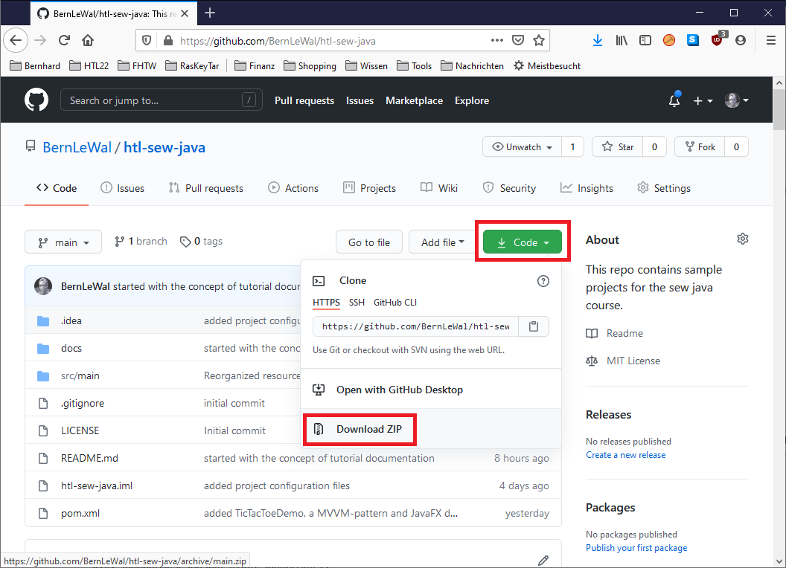
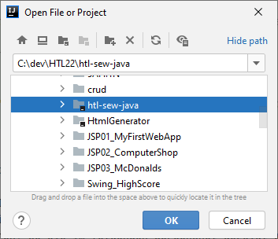

# Modul 0: Bevor es losgeht
[Module 0 in english](Module0.md)

## 1. Source-Beispiele herunterladen
Damit du diesen Kurs machen kannst benötigst du das Projekt mit allen Source-Beispielen, dass du von GITHUB herunterladen kannst:  
[github repo: htl-sew-java](https://github.com/BernLeWal/htl-sew-java)

Dort auf den grünen "Code"-Button klicken und am einfachsten (für nicht git-Nutzer) Download-ZIP auswählen,
wie im Screenshot unten dargestellt:  

Die heruntergeladene ZIP-Datei auf deinem Computer entpacken, z.B. im "Dokumente"-Ordner.

## 2. Entwicklungsumgebung installieren
Als Entwicklungsumgebung, das ist die Software mit der Java-Programme geschrieben und getestet werden, wird in diesem Kurs
IntelliJ von JetBrains verwendet, das in der Community-Edition kostenlos ist und unter folgendem Link
[Herunterladen IntelliJ IDEA](https://www.jetbrains.com/de-de/idea/download/)
heruntergelasen und installiert werden kann.

## 3. Projekt in der Entwicklungsumgebung öffnen
Jetzt wird noch IntelliJ gestartet und das Projekt htl-sew-java geöffnet, navigiere dazu im "Open Project"-Dialog
an die Stelle wo du zuvor das ZIP-File entpackt hast, im folgenden Beispiel war es "C:\dev\HTL22\htl-sew-java":  

## Jetzt bist du bereit für dein erstes Java Programm!

