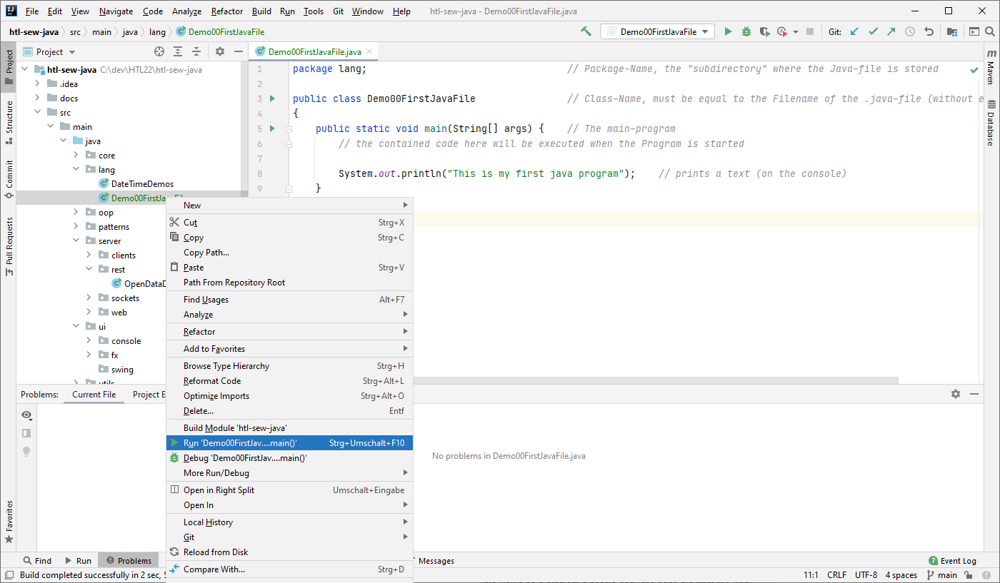

# Modul 1: Lerne die Grundlagen der Java Programmiersprache kennen
[Module 1 in english](Module1.md)

## 1. Java Grundgerüst

Zeigt das Grundgerüst, Syntax und primitive Datentypen mit Java.

### Grundgerüst einer Java-Datei:
Die einfachste Java-Datei mit dem Dateinamen "Demo00Start.java" sieht folgendermaßen aus:
```java
package lang;                                   // Package-Name, das "Unterverzeichnis" in dem die Java-Datei gespeichert ist

public class Demo00Start                        // Klassenname, muss gleichlauten wie der Dateiname der .java-Datei (ohne Dateierweiterung) 
{
    public static void main(String[] args) {    // Hauptprogramm, wird exakt immer so definiert
        // Der hier enthaltene Sourcecode wird ausgeführt wenn das Programm gestartet wird

        System.out.println("This is my first java program");    // gibt einen Text (auf der Konsole) aus
    }
}
```
Beispielprogramm: [lang/Demo00Start.java](../src/main/java/lang/Demo00Start.java)

Zum Starten dieses Programms in der Entwicklungsumgebung IntelliJ 
mit der rechten Maustaste auf die Datei "Demo00FirstJavaFile.java" klicken
und im Popup-Menü "Run Demo00FirstJavaFile.main()" ausführen, so wie im folgenden Screenshot gezeigt wird:


Die Java-Dateien sind hierarchisch in Unterverzeichnissen geordnet, so wie man es z.B. aus dem Windows Explorer kennt.  
Das __Package__, das im Sourcecode immer oben angegeben ist, entspricht dem Unterverzeichnis (ausgehend vom "src"-Verzeichnis)
wo die Datei gespeichert ist.  
Gibt es mehrere Verzeichnisebenen, so wird statt dem '/'-Zeichen ein '.' verwendet,  
z.B. Verzeichnis "oop/inheritance" wird zum Package-Namen ```oop.inheritance``` 

### Kommentare:
Kommentare sind beliebige Erklärungstexte für den Programmier und enthalten keinen Source-Code, 
d.h. Kommentare werden nicht ausgeführt.

```java
// Alles nach diesen beiden Zeichen ist Erklärungstext (gehört nicht zum Code). 

/* Kann überall zwischen oder hinter dem Code eingefügt werden. */
```

### Blöcke von zusammengehörenden Source-Zeilen
```javascript
{
    // Blöcke kann man immer machen ist aber nicht immer // sinnvoll. Ein Anfang gehört immer zum nächsten 
    // Ende, somit kann eines alleine nicht existieren 
    // (führt zu einem Programmfehler). Jede Deklaration 
    // endet mit dem zugehörigen Blockende.
}
```

## 2. Variablen 

### Deklaration von primitiven Datentypen
Sogenannte primitive Datentypen werden für Variablen verwendet,
dort können einfache Werte abgespeichert und z.B. für Berechnungen verwendet werden.

```javascript
// Es wird ein Platz im Speicher bestimmter Größe 
// (je nach Typ) reserviert.

int i;	// Für ganze Zahlen 
long h;	// Für noch längere ganze Zahlen 
double x;	// Für Kommazahlen 
boolean y;	// Für zwei Zustände (wahr/falsch) 
int n,k,l;	// Es können auch mehrere Datentypen (vom
        	// gleichen Typ) in einer Zeile deklariert 
	        // werden
```

### Initialisierung von Variablen durch Zuweisung eines Wertes
Zuweisungen passieren immer von rechts nach links
(der Wert, rechts des = wird in den Speicherplatz des
Datentyps links vom = kopiert)

```javascript
i = 5; 
y = true;
// Deklaration mit anschließender Initialisierung
double pi = 3.14159;
// Wert kann auch von anderer Variable stammen
x = pi;
```

### Text und Zeichenketten (String)
Hinweise: Objekte sind keine primitiven Datentypen
```javascript
// Klassenname objektname = new Klassenname(); 
String text = new String(); // Das Objekt ist hier „text“ von der Klasse String
                            // hier wird deklariert und initialisiert in einer Zeile
String wort;		        // Das ist nur eine Deklaration eines Objekts, 
wort = new String();	    // und hier wird initialisiert.

```

Beispielprogramm: [lang/Demo01Grundlagen.java](../src/main/java/lang/Demo01Grundlagen.java)

## 3. Mit dem User interagieren: einfache Ein- und Ausgabe

### Ausgabe von Text und Variablenwerten
```javascript
System.out.println("Ausgabe von Text " + variable); // mit Zeilenumbruch
System.out.print("Ausgabe von Text " + variable);   // ohne Zeilenumbruch
```

### Tastatureingaben
Die Eingabe über die Tastatur kann man z.B. mit der Klasse Scanner durchführen
```javascript
Scanner sc = new Scanner(System.in);
wort = sc.next();   // ein Wort einlesen
i = sc.nextInt();   // eine Zahl einlesen
zeile = sc.nextLine();  // eine ganze Textzeile einlesen (bis der User die ENTER-Taste drückt)
```

Beispielprogramm: [lang/Demo03EinUndAusgabe.java](../src/main/java/lang/Demo03EinUndAusgabe.java)

## 4. Ablaufsteuerung in Programmen

### Einfache Verzweigung ```if```
Verzweigungen sind immer an Bedingungen geknüpft.
```javascript
if ( i < 5 )
{
    // weiteren Code hier einfügen, dieser wird nur
    // ausgeführt wenn die Bedingung „wahr“ ist !
}
```

### Bedingungen
Eine Bedingung hat nur zwei Ergebnisse, entweder „wahr“ oder „falsch“.
Beim Ausführen steht statt der Bedingung nur mehr true oder false an dieser Stelle:

```javascript
    a > b 	    // Die Bedingung ist wahr wenn a größer b ist. 
    a >= b 	    // … wahr wenn a größer oder gleich b ist.
    a < b 	    // … wahr wenn a kleiner b ist.
    a <= b 	    // … wahr wenn a kleiner oder gleich b ist.
    a == b 	    // … wahr wenn a gleich b ist.
    a != b 	    // … wahr wenn a ungleich b ist.
    !(Bedingung)    // Dreht die Bedingung um, wahr wird zu falsch und umgekehrt.
```

### Verzweigung ```if/else```
```javascript
if ( i < 5 )
{
    // weiteren Code hier einfügen, dieser wird nur
    // ausgeführt wenn die Bedingung „wahr“ ist !
}
else
{
    // weiteren Code hier einfügen, dieser wird nur
    // ausgeführt wenn die Bedingung „falsch“ ist !
}
```

###	Schleife – ```for```
Syntax: for (Startwert; Laufbedingung; Schrittweite) { }

```javascript
for (int i=0; i<5; i++) 
{   // 5 Wiederholungen
    // weiteren Code hier einfügen.
} 
// Gleiche Anzahl: 
for(int i=1; i<=5; i++) {}


// Achtung: kein Strichpunkt nach der runden Klammer bei for!
for (int i=0; i<5; i++); 
{
    // Das ist kein Schleifenblock, die Variable i kann hier
    // nicht mehr verwendet werden !!
} 

// Andere Schrittweite: 
for (int i=1; i<5; i=i+2) {}
```

### (Kopfgesteuerte) Schleife – ```while```
Hier ist die Anzahl der Wiederholungen noch nicht ganz klar, und mehr zum Schreiben.
```javascript
int i = 0;
while (i < b) 
{
    // weiteren Code hier einfügen.
    i++; // oder i=i+1;
}
```

### (Fußgesteuerte)	Schleife – ```do/while```
Diese Schleife wird immer zumindest einmal ausgeführt, sonst gleich.
```javascript
int i = 0;
do
{
    // weiteren Code hier einfügen.
    i++;
}
while (i < b);
```

### Und-/Oder- Verknüpfungen
__Logische UND Verknüpfung__: beide Bedingungen müssen wahr sein.

```javascript
if(Bedingung1 && Bedingung2) { 
    // weiteren Code hier einfügen
}
```
&& ... Wenn Bedingung1 bereits falsch ist, dann wird Bedingung2 nicht mehr geprüft.  
& ... Es werden immer beide Bedingungen geprüft.

__Logische ODER Verknüpfung__: zumindest eine der beiden Bedingungen muss wahr sein
```javascript
if (Bedingung1 || Bedingung2) { 
    // weiteren Code hier einfügen
}
```
|| ... Wenn Bedingung1 bereits wahr ist, dann wird Bedingung2 nicht mehr geprüft.  
| ... Es werden immer beide Bedingungen geprüft.

Beispielprogramm: [lang/Demo04AblaufSteuerung.java](../src/main/java/lang/Demo04AblaufSteuerung.java)

## 5. Arbeit mit Variablen und Werten

### Strings
In Java mit Zeichenketten arbeiten.

__String erzeugen und initialisieren:__
```javascript
String zeichenkette = new String();
zeichenkette = "Das ist ein Text!";

// Weitere Möglichkeiten einen String zu initialisieren:
String zeichenkette2 = "Das ist ein Text!";
String zeichenkette3 = new String("Das ist ein Text!");
```
__Zeichen und Zeichenketten auslesen:__
```javascript
zeichenkette = "Das ist ein Text!";
//  Position:   0   4  7    12

// charAt(…) liefert das Zeichen an der angegebenen Stelle
char zeichenT = zeichenkette.charAt( 12 );       // 'T'

// substring(… , …) mit zwei Parameter liefert den Teil vom Start- bis zum Endindex
String kopie1 = zeichenkette.substring(4,7);     // "ist"
// substring(…) mit einem Parameter liefert die Teilzeichenkette ab dem Index bis zum Ende
String kopie2 = zeichenkette.substring(12);      // "Text!"
```
__Anzahl der Zeichen in einer Zeichenkette:__
```javascript
int laenge = zeichenkette.length();
// liefert die Länge der Zeichenkette, hier 17
```
__Suchen in Zeichenketten:__
```javascript
int pos1 = zeichenkette.indexOf("ein");     // liefert die Anfangsposition einer Teilzeichenkette (hier: pos=8),
                                            //bei Nichtfinden ist pos=-1
int pos2 = zeichenkette.indexOf("ein", 9);  // wie vorher, beginnt aber erst bei Parameter2 (Startwert=9)
                                            //zu suchen, (Ergebnis: pos=-1)
```
__Vergleichen von Zeichenketten:__
```javascript
// vergleicht ob beide Texte inkl. Groß-/kleinschreibung ident sind:
boolean gleicherText =
    zeichenkette.equals("Das ist ein Text!");           //true
boolean gleicherInhalt =
    zeichenkette.equalsIgnoreCase("das ist ein text!"); //true
```

Beispielprogramm: [lang/Demo05Strings.java](../src/main/java/lang/Demo05Strings.java)

### Umwandlung von Datentypen
In Java Zeichenketten in Nummern umwandeln und umgekehrt.

__Nummern in Strings umwandeln:__  
Für das Umwandeln von beliebigen primitiven Datentypen in Strings kann man die statische Hilfsfunktion String.valueOf(…) verwenden.
Beispiele:
```javascript
String si = String.valueOf(i);  // aus int wird String
String sf = String.valueOf(f);  // aus float wird String
String sd = String.valueOf(d);  // aus double wird String
```

__Gleitkommazahlen formatieren:__  
Mit der Hilfsfunktion String.format(…) kann man Zahlen schön formatieren,
d.h. die Anzahl der zu erzeugenden Zeichen und Nachkommastellen angeben.
Dabei ist der erste Parameter der sogenannte Format-String und
der zweite Parameter enthält den Wert der ausgegeben werden soll.
Beispiele:
```javascript
String sfd = String.format("%5d", i);   
// liefert "   17" (insgesamt 5 Zeichen)

String sff = String.format("%5.2f", f);
// liefert " 1,20" (insgesamt 5 Zeichen; 2 Nachkommast.)
```

__(Einfache) Umwandlung von Strings in Nummern:__  
Für die Umwandlung von Zeichenketten in primitive Datentypen können die Wrapper-Klassen verwendet werden,
die zu jedem Datentyp existieren, z.B. die Klasse Integer für int, Double für double und Float für float.
```javascript
int i = Integer.valueOf("17").intValue();
float f = Float.valueOf("1.2").floatValue();
double d = Double.valueOf("1.22").doubleValue();
```
Achtung: Kann der String nicht umgewandelt werden, so liefert der obengenannte Code den Wert 0.

__Casting__: Umwandlung von Werten zwischen primitiven Datentypen  
Zahlenwerte können nicht einfach zwischen unterschiedlichen primitiven Datentypen ausgetauscht werden, der Programmierer muss explizit angeben wenn ein Wert bzw. eine Variable als ein anderer Datentyp verwendet werden soll – das nennt man Casten.
```javascript
float f_i = (float)17; // ergibt float mit Wert 17.0f
int i_d = (int)1.2;    // ergibt int mit Wert 1. ACHTUNG: Datenverlust!
double d_f = (double)1.2f; // ergibt double Wert 1.2
```

### Zufallszahlen
```javascript
// Math.random() gibt eine Zufallszahl zwischen 0 und 1 vom Typ double aus.
int zufallszahl = (int)(Math.random()*50+1);    // Zufallszahl zwischen 1 und 50
```

### Restwertdivision
```javascript
if (i % 2 == 0) {
    // weiteren Code hier einfügen, um alle geraden Zahlen von "i" herauszufinden
}
```

Beispielprogramm: [lang/Demo05WerteUmwandeln.java](../src/main/java/lang/Demo05WerteUmwandeln.java)

## 6. Unterprogramme und Funktionen

### Methoden von Objekten
Objekte die von Klassen erstellt werden (z.B. sc vom Scanner oder von String) bieten Methoden an, die aufgerufen werden können.
Methoden sind eine Art Teil-Programme (Unterprogramme, Funktionen) die man nutzen kann.
Näheres dazu siehe [Modul 2: Objektorientiertes Programmieren](Module2_de.md).
```javascript
// Rückgabetyp wert = objektname.methodenname(Parametertyp parname1,..);
String eingabeText = sc.next(); // Scanner sc = new Scanner(System.in);
int eingabeWert = sc.nextInt();
```

### Statische Methoden
Diese Methoden kann man direkt von Klassen aufrufen (man muss kein Objekt erzeugen).
```javascript
// Rückgabetyp wert = Klassenname.methodenname(Parametertyp parname1,..);
double x = Math.sqrt(1234);
double y = Math.sin(x);
```

### Die Idee von eigenen Unterprogrammen und Funktionen
__Was ist eine Prozedur/Funktion?__  
Eine Prozedur/Funktion ist ein „Name“, der mit bestimmtem Code verknüpft ist, sie können…
 * …Informationen an eine Funktion übergeben --> mittels (Funktions-)Parametern
 * …Funktionen Code ausführen lassen --> (Funktions-)Implementierung
 * …dafür sorgen, dass die Funktion auch Informationen zurückgibt --> Rückgabewert

__Wann soll ich mit einer Funktion arbeiten?__  
...für immer _wiederkehrende Arbeiten_, die sich von der Art her _sehr ähnelt_.

__Vorgang beim Erstellen von Funktionen:__
1.	Gemeinsame Kennzeichen des Problems aufgreifen...
2.	...In eine separate Funktion verschieben
3.	So bleiben nur noch die Unterschiede übrig
4.	--> diese als Parameter beim Funktionsaufruf verwenden.

__Vorteile:__
 * Tipparbeit sparen
 * Fehlerprüfung durch den Computer (Compiler)
 * Wiederverwendbarkeit
 * Behandlung von Bugs: einmal reparieren überall funktioniert es richtig
 * Code ist einfacher zu lesen/verstehen und zu pflegen

### Eigene (statische) Methoden
```javascript
// Aufruf der Methode ohne Rückgabewert aus der Eigenen Klasse:
// EigenerKlassenname.methodenname(parameter1, parameter2);
Main.multipliziereUndAusgeben(5,4); // Eigenen Klasse ist “Main“

// Aufruf der Methode mit Rückgabewert aus der Eigenen Klasse:
// Rückgabetyp wert = EigenerKlassenname.methodenname(param1, param2);
int wert = Main.multipliziere(5,4); // Eigenen Klasse ist “Main“


// Syntax:  statische Methode ohne Rückgabewert
//public static void methodenname(Parametertyp1 par1, Parametertyp2 par2) {
//  //weiteren Code hier einfügen.
//} 
// Beispiel:
public static void multipliziereUndAusgeben(int x, int y) {
    int ergebnis = x*y;
    System.out.println(ergebnis);
}

// Syntax:  statische Methode mit Rückgabewert
//public static Rückgabetyp methodenname(Parametertyp1 par1, Parametertyp2 par2) {
//  //weiteren Code hier einfügen.
//  return ergebnis;
//} 
// Beispiel:
public int void multipliziere(int x, int y) {
    int ergebnis = x*y;
    return ergebnis;
}
```

## 8. Arrays - Listen von mehreren Werten
Ein Array ist nichts anderes als eine Liste in der Werte eines bestimmten 'Typs' stehen. 
Diese Liste ist nummeriert von 0 an.

Man kann sich ein Array vorstellen wie einen Kasten mit Schubladen.
Der Kasten repräsentiert die Array-Variable – um zur Lade zu gelangen müssen wir zum Kasten gehen.
Die Anzahl der Schubladen entspricht der Größe des Arrays, d.h. ein Array mit 5 Elementen würde ein Kasten mit 5 Schubladen sein.
Die Schubladen sind durchnummeriert, z.B. von oben nach unten. 
Ganz im Programmierer-Stil beginnen wir die Zählweise mit 0, d.h. die oberste Schublade hat die Nummer 0.

###	Deklaration
Dem Compiler (Computer) mitteilen, dass es ein Array mit einem bestimmten Namen gibt.
```javascript
int[] zahlen;	// ein einfaches Array vom Datentyp int
double[] komma;	// ein Array vom Datentyp double
```

###	Initialisierung
Festlegung wie groß das Array wird, d.h. wie viele Elemente es enthält.
```javascript
zahlen = new int[5];	// um 5 int Elemente abzuspeichern
komma = new double[7];	// um 7 double Elemente abzuspeichern
```

Oder deklarieren und initialisieren in einem Schritt – ‚Das Array wird erzeugt’:
```javascript
int[] zahlen = new int[5];
double[] komma = new double[7];
```

###	Werte zuweisen
Ein Array zu befüllen, d.h. den einzelnen Elementen einen ‚Wert zuweisen’:
```javascript

zahlen[0] = 3;	//Über den Index (Wert in der Eckigen Klammer) kann man ein einzelnes Element ansprechen,  
                //und z.B. einen Zahlenwert 3 zuweisen.
                //Wichtig: Der Index beginnt beim Wert 0 und
zahlen[4] = 2;	//läuft bis n-1 (wenn n die Größe des Array’s).

zahlen[5] = 8;	//ACHTUNG: Der Index gleich der Größe des Array’s führt zu einer Fehlermeldung!
```

###	Inhalt abrufen
Den Inhalt eines Array’s abzurufen erfolgt ganz einfach über den Index
```javascript
int x = zahlen[0];	// x hätte nun den Wert 3 (Index==0)
```

###	Arbeiten mit Arrays
Da Arrays mehrere Werte speichern verwendet man oft Schleifen um die Elemente eines Arrays durchzugehen.

###	Array mit Schleife befüllen
```javascript
for (int i = 0; i < zahlen.length /*Größe des Arrays*/; i++) {
    zahlen[i] = new Random().nextInt(6) + 1;
}
```

###	Array mit Schleife auslesen / iterieren
Man kann zum durchgehen aller Elemente die for-Schleife von vorhin (2.1) verwenden. Eleganter ist es aber ein for…each Konstrukt zu verwenden, es geht alle Elemente des Arrays durch und speichert den aktuellen Wert in der angegebenen Variable, z.B. hier „z“.
```javascript
for (int z : zahlen) {
    System.out.println(z);
}
```

Zur Ausgabe auf der Konsole bzw. in einem String kann man auch folgende Hilfsfunktion verwenden:
```javascript
System.out.println(Arrays.toString(zahlen));
```

###	Array kopieren
Mithilfe der ```Arrays.copyOf``` Funktion wird ein neues Java-Array erstellt und die Werte kopiert.
```javascript
int[] zahlen2 = Arrays.copyOf(zahlen, zahlen.length);
// zahlen2 ist eine Kopie des Arrays

int[] zahlen2 = zahlen; // ACHTUNG: zahlen2 zeigt auf dasselbe Array!
```

###	Array sortieren
Die sort-Funktion sortiert die Elemente innerhalb eines Arrays, d.h. das Array wird verändert.
```javascript
Arrays.sort(zahlen);
System.out.println(Arrays.toString(zahlen));
```

###	In einem Array suchen
```javascript
int index = Arrays.binarySearch(zahlen, 3);
System.out.println("Ein 3er befindet sich an Index=" + index);
```

###	Arrays miteinander vergleichen
```javascript
if (Arrays.equals(zahlen, zahlen2)) {
    System.out.println("Arrays sind gleich!");
} else {
    System.out.println("Arrays sind ungleich!");
}
```

## 9. Datum und Zeit
In Java mit Datum, Zeit und Perioden arbeiten.  

### Heutiges Datum & heutige Uhrzeit ermitteln
```javascript
LocalDateTime now = LocalDateTime.now();    // Datum und Uhrzeit
LocalDate dateNow = LocalDate.now();        // nur Datum
LocalTime timeNow = LocalTime.now();        // nur Uhrzeit
System.out.println("Heute ist der " + now.getDayOfMonth() +
    ". " + now.getMonth().getDisplayName(TextStyle.FULL,Locale.GERMANY) +
    " " + now.getYear());
System.out.println("Es ist jetzt " + now.getHour() +
    ":" + now.getMinute() + "." + now.getSecond());
```
### Bestimmtes Datum / bestimmte Zeit erzeugen
```javascript
LocalDate dateOfBirth = LocalDate.of(1976, Month.JUNE, 3);
System.out.println("Du wurdest an einem " +
    dateOfBirth.getDayOfWeek().getDisplayName(TextStyle.FULL,Locale.GERMANY) +
    " geboren.");

LocalTime timeUE1 = LocalTime.of(8, 15);
System.out.println("Unterrichtsbeginn ist um " + timeUE1.getHour() + ":" + timeUE1.getMinute());

Period schuljahr = Period.ofWeeks(43);
```
### Mit Datum und Zeit rechnen
```javascript
LocalDate date40er = dateOfBirth.plusYears(40);
System.out.println("Dein 40. Geburtstag war an einem " +
    date40er.getDayOfWeek().getDisplayName(TextStyle.FULL,Locale.GERMANY));

LocalTime timeUE2 = timeUE1.plusMinutes(55);
System.out.println("Die 2.UE beginnt um " + timeUE2.getHour() + ":" + timeUE2.getMinute());
```
### Datum-/Zeitdifferenzen berechnen
```javascript
Period lifeTime = dateOfBirth.until(dateNow);
System.out.println("Zwischen deinem Geburtstag und jetzt liegen"+
    lifeTime.getYears() + " Jahre, " +
    lifeTime.getMonths() + " Monate und " +
    lifeTime.getDays() + " Tage.");
```

Beispielprogramm: [lang/Demo09DatumZeit.java](../src/main/java/lang/Demo09DatumZeit.java)

----------

# Anhang

## 1. Primitive Datentypen (skalare Datentypen) in Java

| Name        | Speicherbedarf   | Beschreibung                                                                              | Wertebereich                                              | Beispiel einer   Deklaration | Beispiel einer   Wertangabe |
|-------------|------------------|-------------------------------------------------------------------------------------------|-----------------------------------------------------------|------------------------------|-----------------------------|
| byte        | 8 Bit (=1 Byte)  | für (sehr kleine) ganze Zahlen                                                            | -128..+127                                                | byte b;                      | -1   0   10                 |
| short       | 16 Bit (=2 Byte) | für (kleine) ganze Zahlen                                                                 | -32768..32767                                             | short n;                     | -1000   0   10000           |
| __int__     | 32 Bit (=4 Byte) | für ganze Zahlen                                                                          | -2147483648 … +2147483647                                 | int i;                       | 23   0 -12345               |
| long        | 64 Bit (=8 Byte) | für (große) ganze Zahlen                                                                  | ca. -9*10^18 .. 9*10^18                                   | long l;                      | 1234567890L   0L            |
| char        | 16 Bit (=2 Byte) | für ein einzelnes Zeichen   (UTF-16 kodiert)                                              | \u0000 ... \uFFFF                                         | char c;                      | 'a'   ' ' \u0020            |
| __boolean__ | (1 Bit)          | Zwei Zustände:  wie "wahr"/"falsch",   "ja"/"nein",   "0"/"1"                             | false   true                                              | boolean b;                   | false   true                |
| float       | 32 Bit (=4 Byte) | für (nicht so genaue) Fließkommazahlen.   (IEEE 754 kodiert)   Die Werte sind angenähert! | ca. -3.4*10^38 ... 3.4*10^38   ca. 6-7 Stellen genau      | float f;                     | 5.4f   0.0f   -2.45e-12f    |
| __double__  | 64 Bit (=8 Byte) | für (genauere) Fließkommazahlen.   (IEEE 754 kodiert)   Die Werte sind angenähert!        | ca. -1.79*10^308 .. 1.79*10^308   ca. 14-15 Stellen genau | double d;                    | 12.5   0.0   -2.456e+120    |

## 2. Operatoren in Java

### Arithmetische Operatoren
Die arithmetischen Operatoren erwarten numerische Operanden und liefern einen
numerischen Rückgabewert, wie z.B. bei einer addition.

| Operator 	| Bezeichnung			| Bedeutung
|-----------|-----------------------|------------------------------------------
| +			| Positives Vorzeichen	| +n ist gleichbedeutend mit n
| -			| Negatives Vorzeichen	| -n kehrt das Vorzeichen von n um
| +			| Summe					| a + b ergibt die Summe von a und b
| -			| Differenz				| a – b ergibt die Differenz von a und b
| *			| Produkt				| a * b ergibt das Produkt aus a und b
| /			| Quotient				| a / b ergibt den Quotienten von a und b
| %			| Restwert				| a % b ergibt den Rest der ganzzahligen Division von a durch b.  In Java lässt sich dieser Operator auch auf Fließkommazahlen anwenden.
| ++		| Präinkrement			| ++a ergibt a+1 und erhöht a um 1
| ++		| Postinkrement			| a++ ergibt a und erhöht a um 1
| --		| Prädekrement			| --a ergibt a-1 und verringert a um 1
| --		| Postdekrement			| a—- ergibt a und verringert a um 1

### Relationale Operatoren (Vergleichsoperatoren)
Relationale Operatoren dienen dazu, Ausdrücke miteinander zu vergleichen und in
Abhängigkeit davon einen logischen Rückgabewert zu produzieren.

| Operator	| Bezeichnung	| Bedeutung
|-----------|---------------|--------------------------------------------------------
| ==		| Gleich		| a == b ergibt true, wenn a gleich b ist.  Sind a und b Referenztypen, so ist der Rückgabewert true wenn beide Werte auf dasselbe Objekt zeigen.
| !=		| Ungleich		| a != b ergibt true, wenn a ungleich b ist.  Sind a und b Objekte, so ist der Rückgabewert true, wenn beide Werte auf unterschiedliche Objekte zeigen.
| <			| Kleiner		| a < b ergibt true, wenn a kleiner b ist
| <=		| Kleiner gleich| 	a <= b ergibt true, wenn a kleiner oder gleich b ist.
| \>		| Größer		| a > b ergibt true, wenn a größer b ist
| >=		| Größer gleich	| a >= b ergibt true, wenn a größer oder gleich b ist.

### Logische Operatoren
Logische Operatoren dienen dazu, boolesche Werte miteinander zu verknüpfen und werden zur Weiterverarbeitung von Wahrheitswerten verwendet.
Java stellt die UND- und ODER-Verknüpfungen in zwei verschiedenen Varianten zur Verfügung:  
nämlich mit und ohne __Short-Circuit-Evaluation__.  
Bei der Short-Circuit-Evaluation eines logischen Ausdrucks wird ein weiter rechts stehender
Teilausdruck nur dann ausgewertet, wenn er für das Ergebnis des Gesamtausdrucks noch von Bedeutung ist

| Operator	| Bezeichnung						| Bedeutung
|-----------|-----------------------------------|---------------------------------------------------------------
| !			| Logisches NICHT					| !a ergibt false, wenn a wahr ist, und true, wenn a false ist.
| &&		| UND mit Short-Circuit-Evaluation	| a && b ergibt true, wenn sowohl a als auch b wahr sind. Ist a bereits falsch, so wird false zurückgegeben und b nicht mehr ausgewertet.
| \|\|	    | ODER mit Short-Circuit-Evaluation	| a \|\| b ergibt true, wenn mindestens einer der beiden Ausdrücke a oder b wahr ist. Ist bereits a wahr, so wird true zurückgegeben und b nicht mehr ausgewertet.
| &			| UND ohne Short-Circuit-Evaluation	| a & b ergibt true, wenn sowohl a als auch b wahr sind. Beide Teilausdrücke werden ausgewertet.
| \|		| ODER ohne Short-Circuit-Eval.		| a \| b ergibt true, wenn mindestens einer der beiden Ausdrücke a oder b wahr ist. Beide Teilausdrücke werden ausgewertet.
| ^			| Exklusiv-ODER						| a ^ b ergibt true, wenn beide Ausdrücke einen unterschiedlichen Wahrheitswert haben.

### Bitweise Operatoren
Mit Hilfe der bitweisen Operatoren kann auf die Binärdarstellung von numerischen
Operanden zugegriffen werden. Ein numerischer Datentyp wird dabei als Folge von Bits
angesehen, die mit Hilfe der bitweisen Operatoren einzeln abgefragt und manipuliert werden
können.

| Operator	| Bezeichnung		| Bedeutung
|-----------|-------------------|--------------------------------------------------------------
| ~			| Einerkomplement	| ~a entsteht aus a, indem alle Bits von a invertiert werden.
| \|		| Bitweises ODER	| a | b ergibt den Wert, der entsteht, wenn die korrespondierenden Bits von a und b miteinander ODER-verknüpft werden.
| &			| Bitweises UND		| a & b ergibt den Wert, der entsteht, wenn die korrespondierenden Bits von a und b miteinander UND-verknüpft werden.
| ^			| Bitweises Exklusiv-ODER	| a ^ b ergibt den Wert, der entsteht, wenn die korrespondierenden Bits von a und b miteinander Exklusiv-ODER-verknüpft werden
| \>>		| Rechtsschieben mit Vorzeichen	| a >> b ergibt den Wert, der entsteht, wenn alle Bits von a um b Positionen nach rechts geschoben werden. Falls das höchstwertige Bit gesetzt ist (a also negativ ist), wird auch das höchstwertige Bit des Resultats gesetzt.
| \>>>		| Rechtsschiebung ohne Vorzeichen	| a >>> b ergibt den Wert, der entsteht, wenn alle Bits von a um b Positionen nach rechts geschoben werden. Dabei wird das höchstwertige Bit des Resultats immer auf 0 gesetzt.
| <<		| Linksschieben		| a << b ergibt den Wert, der entsteht, wenn alle Bits von a um b Positionen nach links geschoben werden. Das niederwertigste Bit wird mit 0 aufgefüllt, das höchstwertige Bit (also das Vorzeichen) wird von a übernommen.


### Zuweisungsoperationen
Die Zuweisung ist keine Anweisung, sondern ein Ausdruck, der einen Rückgabewert erzeugt.

| Operator	| Bezeichnung				| Bedeutung
|-----------|---------------------------|-----------------------------------------------------------------------------
| =			| Einfache Zuweisung		| a = b weist a den Wert von b zu und liefert b als Rückgabewert.
| +=		| Additionszuweisung		| a += b weist a den Wert von a + b zu und liefert a + b als Rückgabewert.
| -=		| Subtraktions-zuweisung	| a -= b weist a den Wert von a – b zu und liefert a – b als Rückgabewert.
| *=		| Multiplikations-zuweisung	| a *= b weist a den Wert von a * b zu und liefert a * b als Rückgabewert.
| /=		| Divisionszuweisung		| a /= b weist a den Wert von a / b zu und liefert a /b als Rückgabewert.
| %=		| Modulo Zuweisung			| a %= b weist a den Wert von a % b zu und liefert a % b als Rückgabewert.
| \|=		| ODER-Zuweisung			| a \|= b weist a den Wert von a | b zu und liefert a | b als Rückgabewert.
| &=		| UND-Zuweisung				| a &= b weist a den Wert von a & b zu und liefert a & b als Rückgabewert.
| ^=		| Exclusiv-ODER- Zuweisung	| a ^= b weist a den Wert von a ^ b zu und liefert a ^ b als Rückgabewert.
| <<=		| Linksschiebe-zuweisung	| a <<= b weist a den Wert von a << b zu und liefert a << b als Rückgabewert.
| >>=		| Rechtsschiebe-zuweisung	| a >>= b weist a den Wert von a >> b zu und liefert a >> b als Rückgabewert.
| >>>=		| Rechtsschiebe-zuweisung mit Nullexpansion		| a >>>= b weist a den Wert von a >>> b zu und liefert a >>> b als Rückgabewert.

